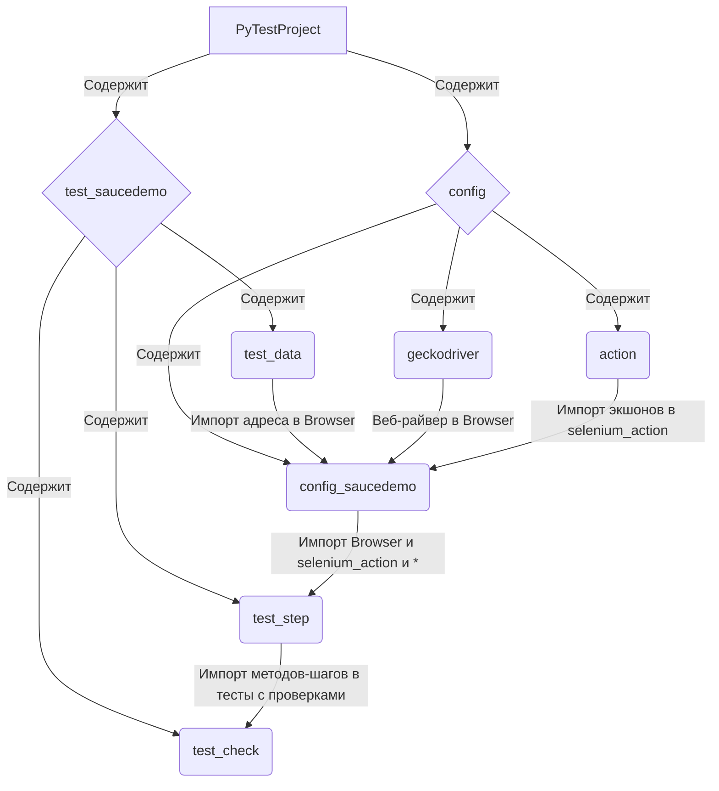
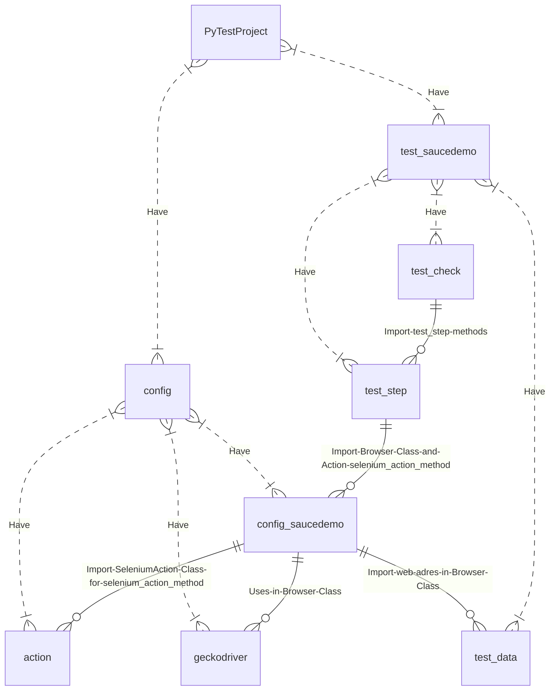

# Структура проекта:

## Стуруктура проекта на примере test_saucedemo
"Наглядная" диаграмма работы проекта и его внутренней связанности

```mermaid
flowchart TD
    A[PyTestProject] -->|Содержит| B{config}
        B -->|Содержит| Q(action)
        B -->|Содержит| W(geckodriver)
        B -->|Содержит| E(config_saucedemo)
    A -->|Содержит| C{test_saucedemo}
        C -->|Содержит| R(test_step)
        C -->|Содержит| T(test_check)
        C -->|Содержит| Y(test_data)
    Y -->|Импорт адреса в Browser| E
    W -->|Веб-райвер в Browser| E
    R -->|Импорт методов-шагов в тесты с проверками| T
    Q -->|Импорт экшонов в selenium_action| E
    E -->|Импорт Browser и selenium_action и *| R
```
Альтернативная "интуитивно понятная" диаграмма

```mermaid
erDiagram
    PyTestProject }|..|{ config : Have
    config }|..|{ action : Have
    config }|..|{ geckodriver : Have
    config }|..|{ config_saucedemo : Have
    config_saucedemo ||--o{ geckodriver : Uses-in-Browser-Class
    config_saucedemo ||--o{ action : Import-SeleniumAction-Class-for-selenium_action_method
    config_saucedemo ||--o{ test_data : Import-web-adres-in-Browser-Class
    PyTestProject }|..|{ test_saucedemo : Have
    test_saucedemo }|..|{ test_step : Have
    test_saucedemo }|..|{ test_check : Have
    test_saucedemo }|..|{ test_data : Have
    test_step ||--o{ config_saucedemo : Import-Browser-Class-and-Action-selenium_action_method
    test_check ||--o{ test_step : Import-test_step-methods
```
